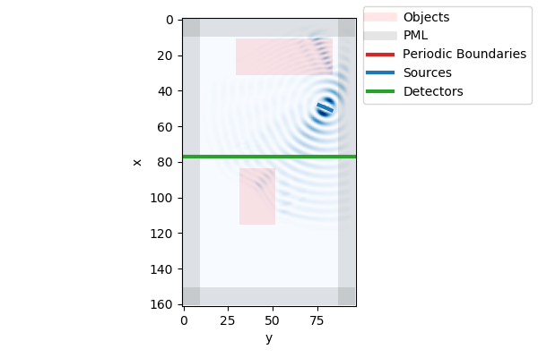
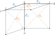

# Python 3D FDTD Simulator


A 3D electromagnetic FDTD simulator written in Python. The FDTD simulator has
an optional PyTorch backend, enabling FDTD simulations on a GPU.

## Installation

The `fdtd`-library can be installed with `pip`:

```
pip install fdtd
```


## Dependencies

- python 3.6+
- numpy
- scipy
- matplotlib
- tqdm
- pytorch (optional)


### Imports

The `fdtd` library is simply imported as follows:

```python
import fdtd
```

### Setting the backend

The `fdtd` library allows to choose a backend. The `"numpy"` backend is the
default one, but there are also several additional PyTorch backends:

- `"numpy"` (defaults to float64 arrays)
- `"torch"` (defaults to float64 tensors)
- `"torch.float32"`
- `"torch.float64"`
- `"torch.cuda"` (defaults to float64 tensors)
- `"torch.cuda.float32"`
- `"torch.cuda.float64"`

For example, this is how to choose the `"torch"` backend:

```python
fdtd.set_backend("torch")
```

In general, the `"numpy"` backend is preferred for standard CPU calculations
with `"float64"` precision. In general, `"float64"` precision is always
preferred over `"float32"` for FDTD simulations, however, `"float32"` might
give a significant performance boost.

The `"cuda"` backends are only available for computers with a GPU.

### The FDTD-grid

The FDTD grid defines the simulation region.

```python
# signature
fdtd.Grid(
    shape: Tuple[Number, Number, Number],
    grid_spacing: float = 155e-9,
    permittivity: float = 1.0,
    permeability: float = 1.0,
    courant_number: float = None,
)
```

A grid is defined by its `shape`, which is just a 3D tuple of `Number`-types
(integers or floats). If the shape is given in floats, it denotes the width,
height and length of the grid in meters. If the shape is given in integers, it
denotes the width, height and length of the grid in terms of the
`grid_spacing`. Internally, these numbers will be translated to three integers:
`grid.Nx`, `grid.Ny` and `grid.Nz`.

A `grid_spacing` can be given. For stability reasons, it is recommended to
choose a grid spacing that is at least 10 times smaller than the _smallest_
wavelength in the grid. This means that for a grid containing a source with
wavelength `1550nm` and a material with refractive index of `3.1`, the
recommended minimum `grid_spacing` turns out to be `50nm`

For the `permittivity` and `permeability` floats or arrays with the following
shapes

- `(grid.Nx, grid.Ny, grid.Nz)`
- or `(grid.Nx, grid.Ny, grid.Nz, 1)`
- or `(grid.Nx, grid.Ny, grid.Nz, 3)`

are expected. In the last case, the shape implies the possibility for different
permittivity for each of the major axes (so-called _uniaxial_ or _biaxial_
materials). Internally, these variables will be converted (for performance
reasons) to their inverses `grid.inverse_permittivity` array and a
`grid.inverse_permeability` array of shape `(grid.Nx, grid.Ny, grid.Nz, 3)`. It
is possible to change those arrays after making the grid.

Finally, the `courant_number` of the grid determines the relation between the
`time_step` of the simulation and the `grid_spacing` of the grid. If not given,
it is chosen to be the maximum number allowed by the [Courant-Friedrichs-Lewy
Condition](https://en.wikipedia.org/wiki/Courant–Friedrichs–Lewy_condition):
`1` for `1D` simulations, `1/√2` for `2D` simulations and `1/√3` for `3D`
simulations (the dimensionality will be derived by the shape of the grid). For
stability reasons, it is recommended not to change this value.

```python
grid = fdtd.Grid(
    shape = (25e-6, 15e-6, 1), # 25um x 15um x 1 (grid_spacing) --> 2D FDTD
)
print(grid)
```

    Grid(shape=(161,97,1), grid_spacing=1.55e-07, courant_number=0.70)

### Adding an object to the grid

An other option to locally change the `permittivity` or `permeability` in the
grid is to add an `Object` to the grid.

```python
# signature
fdtd.Object(
    permittivity: Tensorlike,
    name: str = None
)
```

An object defines a part of the grid with modified update equations, allowing
to introduce for example absorbing materials or biaxial materials for which
mixing between the axes are present through `Pockels coefficients` or many
more. In this case we'll make an object with a different `permittivity` than
the grid it is in.

Just like for the grid, the `Object` expects a `permittivity` to be a floats or
an array of the following possible shapes

- `(obj.Nx, obj.Ny, obj.Nz)`
- or `(obj.Nx, obj.Ny, obj.Nz, 1)`
- or `(obj.Nx, obj.Ny, obj.Nz, 3)`

Note that the values `obj.Nx`, `obj.Ny` and `obj.Nz` are not given to the
object constructor. They are in stead derived from its placing in the grid:

```python
grid[11:32, 30:84, 0] = fdtd.Object(permittivity=1.7**2, name="object")
```

Several things happen here. First of all, the object is given the space
`[11:32, 30:84, 0]` in the grid. Because it is given this space, the object's
`Nx`, `Ny` and `Nz` are automatically set. Furthermore, by supplying a name to
the object, this name will become available in the grid:

```python
print(grid.object)
```

        Object(name='object')
            @ x=11:32, y=30:84, z=0:1

A second object can be added to the grid:

```python
grid[13e-6:18e-6, 5e-6:8e-6, 0] = fdtd.Object(permittivity=1.5**2)
```

Here, a slice with floating point numbers was chosen. These floats will be
replaced by integer `Nx`, `Ny` and `Nz` during the registration of the object.
Since the object did not receive a name, the object won't be available as an
attribute of the grid. However, it is still available via the `grid.objects`
list:

```python
print(grid.objects)
```

    [Object(name='object'), Object(name=None)]

This list stores all objects (i.e. of type `fdtd.Object`) in the order that
they were added to the grid.

### Adding a source to the grid

Similarly as to adding an object to the grid, an `fdtd.LineSource` can also be
added:

```python
# signature
fdtd.LineSource(
    period: Number = 15, # timesteps or seconds
    amplitude: float = 1.0,
    phase_shift: float = 0.0,
    name: str = None,
)
```

And also just like an `fdtd.Object`, an `fdtd.LineSource` size is defined by its
placement on the grid:

```python
grid[7.5e-6:8.0e-6, 11.8e-6:13.0e-6, 0] = fdtd.LineSource(
    period = 1550e-9 / (3e8), name="source"
)
```

However, it is important to note that in this case a `LineSource` is added to
the grid, i.e. the source spans the diagonal of the cube defined by the slices.
Internally, these slices will be converted into lists to ensure this behavior:

```python
print(grid.source)
```

        LineSource(period=14, amplitude=1.0, phase_shift=0.0, name='source')
            @ x=[48, ... , 51], y=[76, ... , 83], z=[0, ... , 0]

Note that one could also have supplied lists to index the grid in the first
place. This feature could be useful to create a `LineSource` of arbitrary
shape.

### Adding a detector to the grid

```python
# signature
fdtd.LineDetector(
    name=None
)
```

Adding a detector to the grid works the same as adding a source

```python
grid[12e-6, :, 0] = fdtd.LineDetector(name="detector")
```

```python
print(grid.detector)
```

        LineDetector(name='detector')
            @ x=[77, ... , 77], y=[0, ... , 96], z=[0, ... , 0]

### Adding grid boundaries

```python
# signature
fdtd.PML(
    a: float = 1e-8, # stability factor
    name: str = None
)
```

Although, having an object, source and detector to simulate is in principle
enough to perform an FDTD simulation, One also needs to define a grid boundary
to prevent the fields to be reflected. One of those boundaries that can be
added to the grid is a [Perfectly Matched
Layer](https://en.wikipedia.org/wiki/Perfectly_matched_layer) or `PML`. These
are basically absorbing boundaries.

```python
# x boundaries
grid[0:10, :, :] = fdtd.PML(name="pml_xlow")
grid[-10:, :, :] = fdtd.PML(name="pml_xhigh")

# y boundaries
grid[:, 0:10, :] = fdtd.PML(name="pml_ylow")
grid[:, -10:, :] = fdtd.PML(name="pml_yhigh")
```

### Grid summary

A simple summary of the grid can be shown by printing out the grid:

```python
print(grid)
```

    Grid(shape=(161,97,1), grid_spacing=1.55e-07, courant_number=0.70)

    sources:
        LineSource(period=14, amplitude=1.0, phase_shift=0.0, name='source')
            @ x=[48, ... , 51], y=[76, ... , 83], z=[0, ... , 0]

    detectors:
        LineDetector(name='detector')
            @ x=[77, ... , 77], y=[0, ... , 96], z=[0, ... , 0]

    boundaries:
        PML(name='pml_xlow')
            @ x=0:10, y=:, z=:
        PML(name='pml_xhigh')
            @ x=-10:, y=:, z=:
        PML(name='pml_ylow')
            @ x=:, y=0:10, z=:
        PML(name='pml_yhigh')
            @ x=:, y=-10:, z=:

    objects:
        Object(name='object')
            @ x=11:32, y=30:84, z=0:1
        Object(name=None)
            @ x=84:116, y=32:52, z=0:1

### Running a simulation

Running a simulation is as simple as using the `grid.run` method.

```python
grid.run(
    total_time: Number,
    progress_bar: bool = True
)
```

Just like for the lengths in the grid, the `total_time` of the simulation
can be specified as an integer (number of `time_steps`) or as a float (in
seconds).

```python
grid.run(total_time=100)
```

### Grid visualization

Let's visualize the grid. This can be done with the `grid.visualize` method:

```python
# signature
grid.visualize(
    grid,
    x=None,
    y=None,
    z=None,
    cmap="Blues",
    pbcolor="C3",
    pmlcolor=(0, 0, 0, 0.1),
    objcolor=(1, 0, 0, 0.1),
    srccolor="C0",
    detcolor="C2",
    show=True,
)
```

This method will by default visualize all objects in the grid, as well as the
field intensity at the current `time_step` at a certain `x`, `y` **OR** `z`-plane. By
setting `show=False`, one can disable the immediate visualization of the
matplotlib image.

```python
grid.visualize(z=0)
```



## Background

An as quick as possible explanation of the FDTD discretization of the Maxwell
equations.

### Update Equations

An electromagnetic FDTD solver solves the time-dependent Maxwell Equations

```python
    curl(H) = ε*ε0*dE/dt
    curl(E) = -µ*µ0*dH/dt
```

These two equations are called _Ampere's Law_ and _Faraday's Law_ respectively.

In these equations, ε and µ are the relative permittivity and permeability
tensors respectively. ε0 and µ0 are the vacuum permittivity and permeability
and their square root can be absorbed into E and H respectively, such that `E := √ε0*E` and `H := √µ0*H`.

Doing this, the Maxwell equations can be written as update equations:

```python
    E  += c*dt*inv(ε)*curl(H)
    H  -= c*dt*inv(µ)*curl(E)
```

The electric and magnetic field can then be discretized on a grid with
interlaced Yee-coordinates, which in 3D looks like this:



According to the Yee discretization algorithm, there are inherently two types
of fields on the grid: `E`-type fields on integer grid locations and `H`-type
fields on half-integer grid locations.

The beauty of these interlaced coordinates is that they enable a very natural
way of writing the curl of the electric and magnetic fields: the curl of an
H-type field will be an E-type field and vice versa.

This way, the curl of E can be written as

```python
    curl(E)[m,n,p] = (dEz/dy - dEy/dz, dEx/dz - dEz/dx, dEy/dx - dEx/dy)[m,n,p]
                   =( ((Ez[m,n+1,p]-Ez[m,n,p])/dy - (Ey[m,n,p+1]-Ey[m,n,p])/dz),
                      ((Ex[m,n,p+1]-Ex[m,n,p])/dz - (Ez[m+1,n,p]-Ez[m,n,p])/dx),
                      ((Ey[m+1,n,p]-Ey[m,n,p])/dx - (Ex[m,n+1,p]-Ex[m,n,p])/dy) )
                   =(1/du)*( ((Ez[m,n+1,p]-Ez[m,n,p]) - (Ey[m,n,p+1]-Ey[m,n,p])), [assume dx=dy=dz=du]
                             ((Ex[m,n,p+1]-Ex[m,n,p]) - (Ez[m+1,n,p]-Ez[m,n,p])),
                             ((Ey[m+1,n,p]-Ey[m,n,p]) - (Ex[m,n+1,p]-Ex[m,n,p])) )

```

this can be written efficiently with array slices (note that the factor
`(1/du)` was left out):

```python
def curl_E(E):
    curl_E = np.zeros(E.shape)
    curl_E[:,:-1,:,0] += E[:,1:,:,2] - E[:,:-1,:,2]
    curl_E[:,:,:-1,0] -= E[:,:,1:,1] - E[:,:,:-1,1]

    curl_E[:,:,:-1,1] += E[:,:,1:,0] - E[:,:,:-1,0]
    curl_E[:-1,:,:,1] -= E[1:,:,:,2] - E[:-1,:,:,2]

    curl_E[:-1,:,:,2] += E[1:,:,:,1] - E[:-1,:,:,1]
    curl_E[:,:-1,:,2] -= E[:,1:,:,0] - E[:,:-1,:,0]
    return curl_E
```

The curl for H can be obtained in a similar way (note again that the factor
`(1/du)` was left out):

```python
def curl_H(H):
    curl_H = np.zeros(H.shape)

    curl_H[:,1:,:,0] += H[:,1:,:,2] - H[:,:-1,:,2]
    curl_H[:,:,1:,0] -= H[:,:,1:,1] - H[:,:,:-1,1]

    curl_H[:,:,1:,1] += H[:,:,1:,0] - H[:,:,:-1,0]
    curl_H[1:,:,:,1] -= H[1:,:,:,2] - H[:-1,:,:,2]

    curl_H[1:,:,:,2] += H[1:,:,:,1] - H[:-1,:,:,1]
    curl_H[:,1:,:,2] -= H[:,1:,:,0] - H[:,:-1,:,0]
    return curl_H
```

The update equations can now be rewritten as

```python
    E  += (c*dt/du)*inv(ε)*curl_H
    H  -= (c*dt/du)*inv(µ)*curl_E
```

The number `(c*dt/du)` is a dimensionless parameter called the _Courant number_
`sc`. For stability reasons, the Courant number should always be smaller than
`1/√D`, with `D` the dimension of the simulation. This can be intuitively be
understood as the condition that information should always travel slower than
the speed of light through the grid. In the FDTD method described here,
information can only travel to the neighboring grid cells (through application
of the curl). It would therefore take `D` time steps to travel over the
diagonal of a `D`-dimensional cube (square in `2D`, cube in `3D`), the Courant
condition follows then automatically from the fact that the length of this
diagonal is `1/√D`.

This yields the final update equations for the FDTD algorithm:

```python
    E  += sc*inv(ε)*curl_H
    H  -= sc*inv(µ)*curl_E
```

This is also how it is implemented:

```python
class Grid:
    # ... [initialization]

    def step(self):
        self.update_E()
        self.update_H()

    def update_E(self):
        self.E += self.courant_number * self.inverse_permittivity * curl_H(self.H)

    def update_H(self):
        self.H -= self.courant_number * self.inverse_permeability * curl_E(self.E)
```

### Sources

Ampere's Law can be updated to incorporate a current density:

```python
    curl(H) = J + ε*ε0*dE/dt
```

Making again the usual substitutions `sc := c*dt/du`, `E := √ε0*E` and `H := √µ0*H`, the update equations can be modified to include the current density:

```python
    E += sc*inv(ε)*curl_H - dt*inv(ε)*J/√ε0
```

Making one final substitution `Es := -dt*inv(ε)*J/√ε0` allows us to write this
in a very clean way:

```python
    E += sc*inv(ε)*curl_H + Es
```

Where we defined Es as the _electric field source term_.

It is often useful to also define a _magnetic field source term_ `Hs`, which would be
derived from the _magnetic current density_ if it were to exist. In the same way,
Faraday's update equation can be rewritten as

```python
    H  -= sc*inv(µ)*curl_E + Hs
```

```python
class Source:
    # ... [initialization]
    def update_E(self):
        # electric source function here

    def update_H(self):
        # magnetic source function here

class Grid:
    # ... [initialization]
    def update_E(self):
        # ... [electric field update equation]
        for source in self.sources:
            source.update_E()

    def update_H(self):
        # ... [magnetic field update equation]
        for source in self.sources:
            source.update_H()
```

### Lossy Medium

When a material has a _electric conductivity_ σ, a conduction-current will
ensure that the medium is lossy. Ampere's law with a conduction current becomes

```python
    curl(H) = σ*E + ε*ε0*dE/dt
```

Making the usual substitutions, this becomes:

```python
    E(t+dt) - E(t) = sc*inv(ε)*curl_H(t+dt/2) - dt*inv(ε)*σ*E(t+dt/2)/ε0
```

This update equation depends on the electric field on a half-integer time step (a
_magnetic field time step_). We need to substitute `E(t+dt/2)=(E(t)+E(t+dt))/2` to
interpolate the electric field to the correct time step.

```python
    (1 + 0.5*dt*inv(ε)*σ/√ε0)*E(t+dt) = sc*inv(ε)*curl_H(t+dt/2) + (1 - 0.5*dt*inv(ε)*σ/ε0)*E(t)
```

Which, yield the new update equations:

```python
    f = 0.5*inv(ε)*σ*sc*du/(ε0*c)
    E *= inv(1 + f) * (1 - f)
    E += inv(1 + f)*sc*inv(ε)*curl_H
```

Note that the more complicated the permittivity tensor ε is, the more time
consuming this algorithm will be. It is therefore sometimes a nice hack to
transfer the absorption to the magnetic domain by introducing a
(_nonphysical_) magnetic conductivity, because the permeability tensor µ is
usually just equal to one:

```python
    f = 0.5*inv(μ)*σm*sc*du/(μ0*c)
    H *= inv(1 + f) * (1 - f)
    H += inv(1 + f)*sc*inv(µ)*curl_E
```

### Energy Density and Poynting Vector

The electromagnetic energy density can be given by

```python
    e = (1/2)*ε*ε0*E**2 + (1/2)*µ*µ0*H**2
```

making the above substitutions, this becomes in simulation units:

```python
    e = (1/2)*ε*E**2 + (1/2)*µ*H**2
```

The Poynting vector is given by

```python
    P = E×H
```

Which in simulation units becomes

```python
    P = c*E×H
```

The energy introduced by a source `Es` can be derived from tracking the change
in energy density

```python
    de = ε*Es·E + (1/2)*ε*Es**2
```

This could also be derived from Poyntings energy conservation law:

```python
    de/dt = -grad(S) - J·E
```

where the first term just describes the redistribution of energy in a volume
and the second term describes the energy introduced by a current density.

Note: although it is unphysical, one could also have introduced a magnetic
source. This source would have introduced the following energy:

```python
    de = ε*Hs·H + (1/2)*µ*Hs**2
```

Since the µ-tensor is usually just equal to one, using a magnetic source term
is often more efficient.

Similarly, one can also keep track of the absorbed energy due to an electric
conductivity in the following way:

```python
    f = 0.5*inv(ε)*σ*sc*du/(ε0*c)
    Enoabs = E + sc*inv(ε)*curl_H
    E *= inv(1 + f) * (1 - f)
    E += inv(1 + f)*sc*inv(ε)*curl_H
    dE = Enoabs - E
    e_abs += ε*E*dE + 0.5*ε*dE**2
```

or if we want to keep track of the absorbed energy by magnetic a magnetic
conductivity:

```python
    f = 0.5*inv(μ)*σm*sc*du/(μ0*c)
    Hnoabs = E + sc*inv(µ)*curl_E
    H *= inv(1 + f) * (1 - f)
    H += inv(1 + f)*sc*inv(µ)*curl_E
    dH = Hnoabs - H
    e_abs += µ*H*dH + 0.5*µ*dH**2
```

The electric term and magnetic term in the energy density are usually of the
same size. Therefore, the same amount of energy will be absorbed by introducing
a _magnetic conductivity_ σm as by introducing a _electric conductivity_ σ if:

```python
    inv(µ)*σm/µ0 = inv(ε)*σ/ε0
```

### Boundary Conditions

#### Periodic Boundary Conditions

Assuming we want periodic boundary conditions along the `X`-direction, then we
have to make sure that the fields at `Xlow` and `Xhigh` are the same. This has
to be enforced after performing the update equations:

Note that the electric field `E` is dependent on `curl_H`, which means that the
first indices of `E` will not be updated through the update equations. It's
those indices that need to be set through the periodic boundary condition.
Concretely: `E[0]` needs to be set to equal `E[-1]`. For the magnetic field,
the inverse is true: `H` is dependent on `curl_E`, which means that its last
indices will not be set. This has to be done by the boundary condition: `H[-1]`
needs to be set equal to `H[0]`:

```python
class PeriodicBoundaryX:
    # ... [initialization]
    def update_E(self):
        self.grid.E[0, :, :, :] = self.grid.E[-1, :, :, :]

    def update_H(self):
        self.grid.H[-1, :, :, :] = self.grid.H[0, :, :, :]

class Grid:
    # ... [initialization]
    def update_E(self):
        # ... [electric field update equation]
        # ... [electric field source update equations]
        for boundary in self.boundaries:
            boundary.update_E()

    def update_H(self):
        # ... [magnetic field update equation]
        # ... [magnetic field source update equations]
        for boundary in self.boundaries:
            boundary.update_H()
```

#### Perfectly Matched Layer

a Perfectly Matched Layer (PML) is the state of the art for
introducing absorbing boundary conditions in an FDTD grid.
A PML is an impedance-matched absorbing area in the grid. It turns out that
for a impedance-matching condition to hold, the PML can only be absorbing in
a single direction. This is what makes a PML in fact a nonphysical material.

Consider Ampere's law for the `Ez` component, where we use the following substitutions:
`E := √ε0*E`, `H := √µ0*H` and `σ := inv(ε)*σ/ε0` are
already introduced:

```python
    ε*dEz/dt + ε*σ*Ez = c*dHy/dx - c*dHx/dy
```

This becomes in the frequency domain:

```python
    iω*ε*Ez + ε*σ*Ez = c*dHy/dx - c*dHx/dy
```

We can split this equation in a x-propagating wave and a y-propagating wave:

```python
    iω*ε*Ezx + ε*σx*Ezx = iω*ε*(1 + σx/iω)*Ezx = c*dHy/dx
    iω*ε*Ezy + ε*σy*Ezy = iω*ε*(1 + σy/iω)*Ezy = -c*dHx/dy
```

We can define the `S`-operators as follows

```python
    Su = 1 + σu/iω          with u in {x, y, z}
```

In general, we prefer to add a stability factor `au` and a scaling factor `ku` to `Su`:

```python
    Su = ku + σu/(iω+au)    with u in {x, y, z}
```

Summing the two equations for `Ez` back together after dividing by the respective `S`-operator gives

```python
    iω*ε*Ez = (c/Sx)*dHy/dx - (c/Sy)*dHx/dy
```

Converting this back to the time domain gives

```python
    ε*dEz/dt = c*sx[*]dHy/dx - c*sx[*]dHx/dy
```

where `sx` denotes the inverse Fourier transform of `(1/Sx)` and `[*]` denotes a convolution.
The expression for `su` can be proven [after some derivation] to look as follows:

```python
    su = (1/ku)*δ(t) + Cu(t)    with u in {x, y, z}
```

where `δ(t)` denotes the Dirac delta function and `C(t)` an exponentially
decaying function given by:

```python
    Cu(t) = -(σu/ku**2)*exp(-(au+σu/ku)*t)     for all t > 0 and u in {x, y, z}
```

Plugging this in gives:

```python
    dEz/dt = (c/kx)*inv(ε)*dHy/dx - (c/ky)*inv(ε)*dHx/dy + c*inv(ε)*Cx[*]dHy/dx - c*inv(ε)*Cx[*]dHx/dy
           = (c/kx)*inv(ε)*dHy/dx - (c/ky)*inv(ε)*dHx/dy + c*inv(ε)*Фez/du      with du=dx=dy=dz
```

This can be written as an update equation:

```python
    Ez += (1/kx)*sc*inv(ε)*dHy - (1/ky)*sc*inv(ε)*dHx + sc*inv(ε)*Фez
```

Where we defined `Фeu` as

```python
    Фeu = Ψeuv - Ψezw           with u, v, w in {x, y, z}
```

and `Ψeuv` as the convolution updating the component `Eu` by taking the derivative of `Hw` in the `v` direction:

```python
    Ψeuv = dv*Cv[*]dHw/dv     with u, v, w in {x, y, z}
```

This can be rewritten [after some derivation] as an update equation in itself:

```python
     Ψeuv = bv*Ψeuv + cv*dv*(dHw/dv)
          = bv*Ψeuv + cv*dHw            with u, v, w in {x, y, z}
```

Where the constants `bu` and `cu` are derived to be:

```python
    bu = exp(-(au + σu/ku)*dt)              with u in {x, y, z}
    cu = σu*(bu - 1)/(σu*ku + au*ku**2)     with u in {x, y, z}
```

The final PML algorithm for the electric field now becomes:

1. Update `Фe=[Фex, Фey, Фez]` by using the update equation for the `Ψ`-components.
2. Update the electric fields the normal way
3. Add `Фe` to the electric fields.

or as python code:

```python
class PML(Boundary):
    # ... [initialization]
    def update_phi_E(self): # update convolution
        self.psi_Ex *= self.bE
        self.psi_Ey *= self.bE
        self.psi_Ez *= self.bE

        c = self.cE
        Hx = self.grid.H[self.locx]
        Hy = self.grid.H[self.locy]
        Hz = self.grid.H[self.locz]

        self.psi_Ex[:, 1:, :, 1] += (Hz[:, 1:, :] - Hz[:, :-1, :]) * c[:, 1:, :, 1]
        self.psi_Ex[:, :, 1:, 2] += (Hy[:, :, 1:] - Hy[:, :, :-1]) * c[:, :, 1:, 2]

        self.psi_Ey[:, :, 1:, 2] += (Hx[:, :, 1:] - Hx[:, :, :-1]) * c[:, :, 1:, 2]
        self.psi_Ey[1:, :, :, 0] += (Hz[1:, :, :] - Hz[:-1, :, :]) * c[1:, :, :, 0]

        self.psi_Ez[1:, :, :, 0] += (Hy[1:, :, :] - Hy[:-1, :, :]) * c[1:, :, :, 0]
        self.psi_Ez[:, 1:, :, 1] += (Hx[:, 1:, :] - Hx[:, :-1, :]) * c[:, 1:, :, 1]

        self.phi_E[..., 0] = self.psi_Ex[..., 1] - self.psi_Ex[..., 2]
        self.phi_E[..., 1] = self.psi_Ey[..., 2] - self.psi_Ey[..., 0]
        self.phi_E[..., 2] = self.psi_Ez[..., 0] - self.psi_Ez[..., 1]

    def update_E(self): # update PML located at self.loc
        self.grid.E[self.loc] += (
            self.grid.courant_number
            * self.grid.inverse_permittivity[self.loc]
            * self.phi_E
        )

class Grid:
    # ... [initialization]
    def update_E(self):
        for boundary in self.boundaries:
            boundary.update_phi_E()
        # ... [electric field update equation]
        # ... [electric field source update equations]
        for boundary in self.boundaries:
            boundary.update_E()
```

The same has to be applied for the magnetic field.

These update equations for the PML were based on
[Schneider, Chap. 11](https://www.eecs.wsu.edu/~schneidj/ufdtd).

## Units

<!---
flaport, if you have the time, I'd appreciate it if you could confirm
that I've understood this correctly.
I'm adding this because I got pretty confused regarding the units;
if you think it's self-evident, feel free to remove.

In particular, is the H := õ0*H scaling really applied nowhere in the library?
Can this be assumed?
--->

As a bare FDTD library, this is dimensionally agnostic for any unit system you may choose.
No conversion factors are applied within the library API; this is left to the user.
(The code used to calculate the Courant limit may be a sticking point depending on the time scale involved).

However, as noted above (`H := õ0*H`), it is generally good numerical practice to scale all values to
get the maximum precision from floating-point types.

In particular, a scaling scheme detailed in ["Novel architectures for brain-inspired photonic computers"](https://www.photonics.intec.ugent.be/download/phd_259.pdf), Chapters 4.1.2 and 4.1.6, is highly recommended.

A set of conversion functions to and from reduced units are available for users in conversions.py.

<!---
On the other hand, use of this scaling scheme really makes most of the new functions less useful,
because the results don't have physical dimensions by default and have to be scaled by weird
coefficients by the user (scale impedance?!?)

grid.H_scaling_factor = sqrt(mu0) ?
--->

## Linter

You can run a linter in the root using `pylint fdtd`.

## License

© Floris laporte - [MIT License](license)
